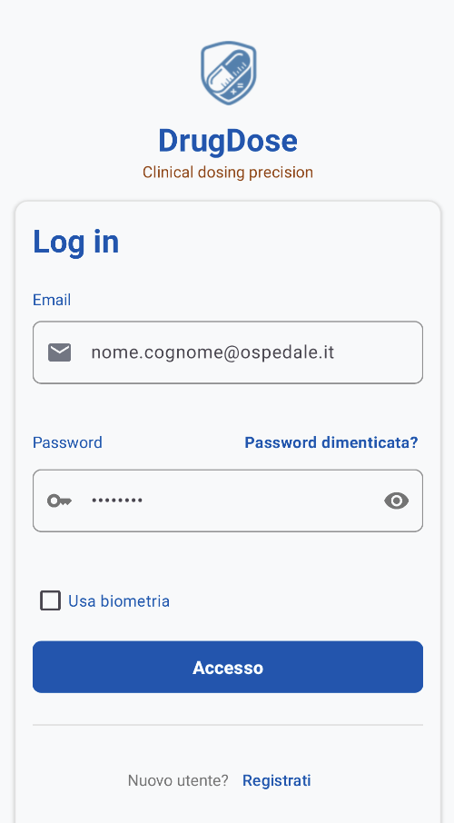
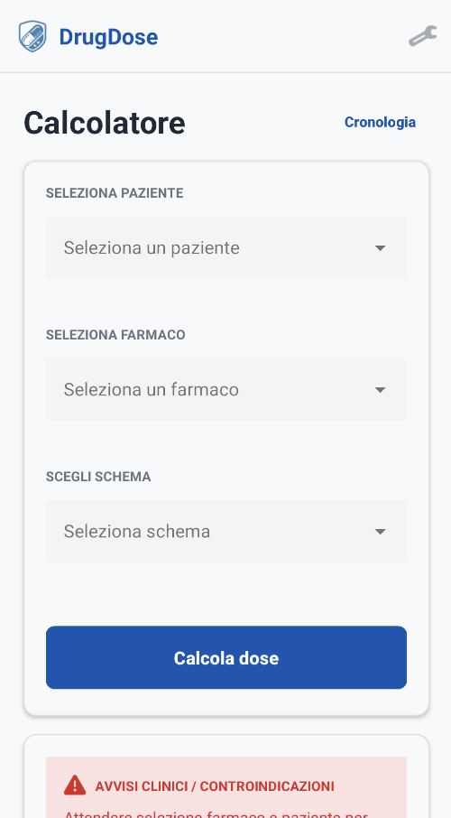
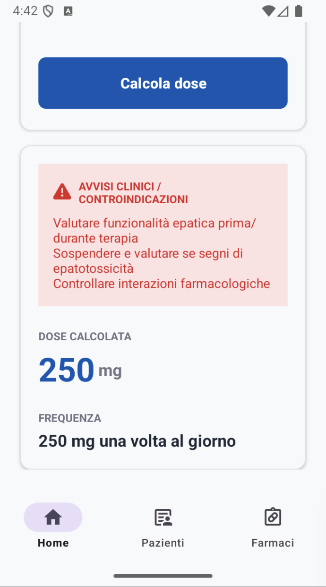
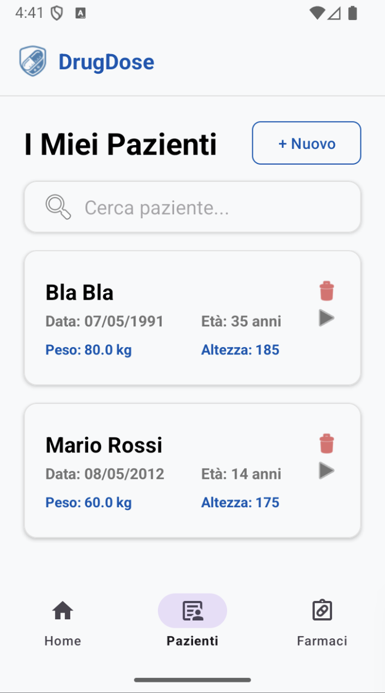
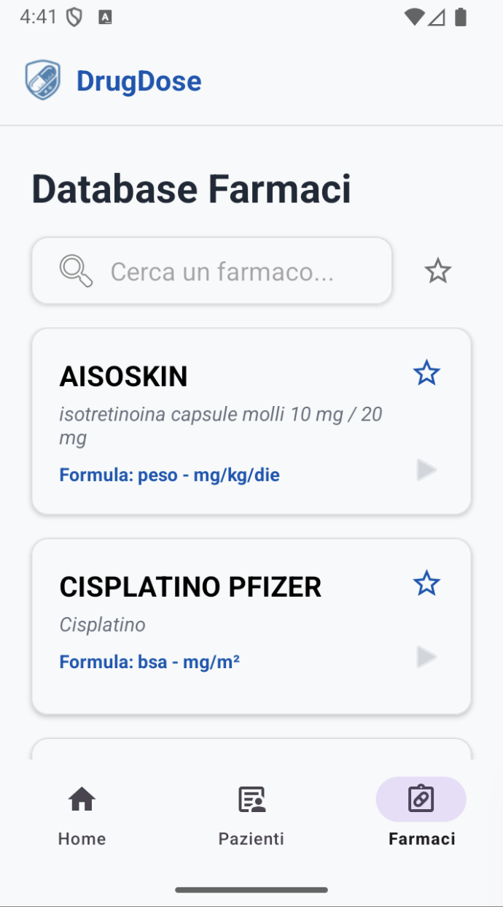
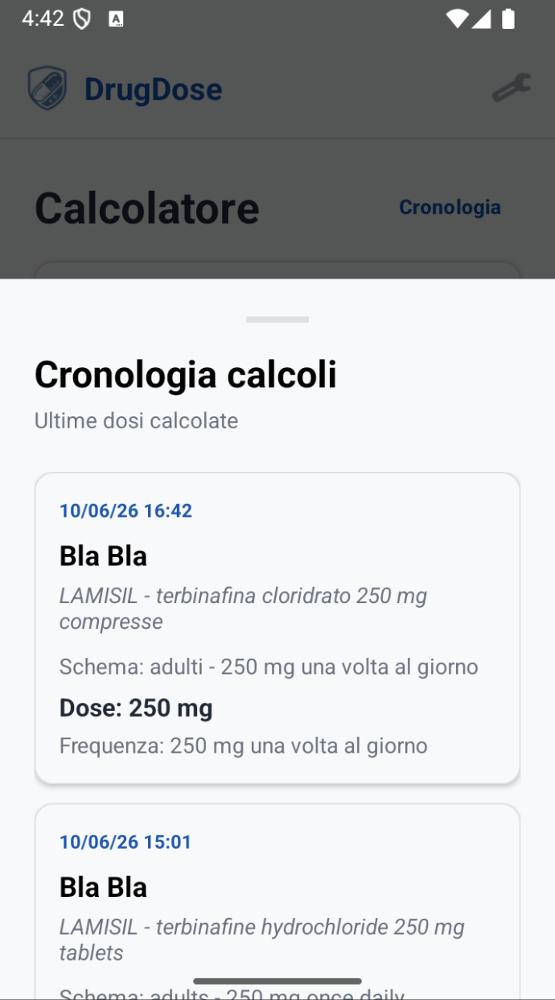

# DrugDose

DrugDose è un'app Android sviluppata in Kotlin per il corso di **Programmazione di Dispositivi Mobili** dell'Università degli Studi dell'Insubria.

L'app simula il calcolo del dosaggio di alcuni farmaci in ambito dermatologico. L'utente può scegliere un paziente, selezionare un farmaco e ottenere una dose calcolata in base a peso, età, altezza e regole del farmaco.

> Progetto universitario a scopo didattico. Non è un dispositivo medico e non va usato per decisioni cliniche reali.

## Team

- Michele Viselli
- Elia Toschi

## Anteprima

| Login | Home |
| --- | --- |
|  |  |

| Calcolo dose | Pazienti |
| --- | --- |
|  |  |

| Farmaci | Storico |
| --- | --- |
|  |  |

## Cosa fa l'app

Con DrugDose è possibile:

- registrarsi o accedere con email e password;
- entrare come ospite;
- salvare e gestire i pazienti;
- consultare una lista di farmaci;
- segnare farmaci come preferiti;
- calcolare una dose partendo dai dati del paziente;
- vedere alert, frequenza e risultato del calcolo;
- consultare lo storico dei calcoli fatti;
- cambiare lingua e tema dell'app.

## Come si usa

Il flusso principale è questo:

1. Si accede all'app.
2. Si crea o seleziona un paziente.
3. Si sceglie un farmaco.
4. Si seleziona lo schema disponibile.
5. Si preme `Calcola dose`.
6. L'app mostra il risultato e salva il calcolo nello storico.

Se il paziente non è compatibile con il farmaco o con lo schema scelto, l'app mostra un messaggio di errore invece di calcolare la dose.

## Schermate principali

- **Home**: contiene il calcolatore della dose.
- **Pazienti**: permette di aggiungere, cercare, selezionare ed eliminare pazienti.
- **Farmaci**: mostra il catalogo dei farmaci, i dettagli e i preferiti.
- **Storico**: mostra i calcoli effettuati.
- **Impostazioni**: permette di cambiare lingua, tema e fare logout.

## Tecnologie usate

- Kotlin
- Android SDK
- XML Layout
- Cloud Firestore
- AndroidX Biometric

## Avvio del progetto

Per aprire il progetto:

1. Clonare il repository.
2. Aprirlo con Android Studio.
3. Verificare che il file `app/google-services.json` sia presente.
4. Sincronizzare Gradle.
5. Avviare l'app su emulatore o dispositivo Android.

Comandi utili:

```bash
./gradlew testDebugUnitTest
./gradlew assembleDebug
```

## Nota finale

DrugDose è stato realizzato per dimostrare un flusso completo di un'app Android: login, gestione dati, interfaccia, Firebase e calcolo guidato.

I dati e i dosaggi presenti sono usati solo per simulazione didattica. L'app **non deve essere usata per prescrizioni o terapie reali**.
